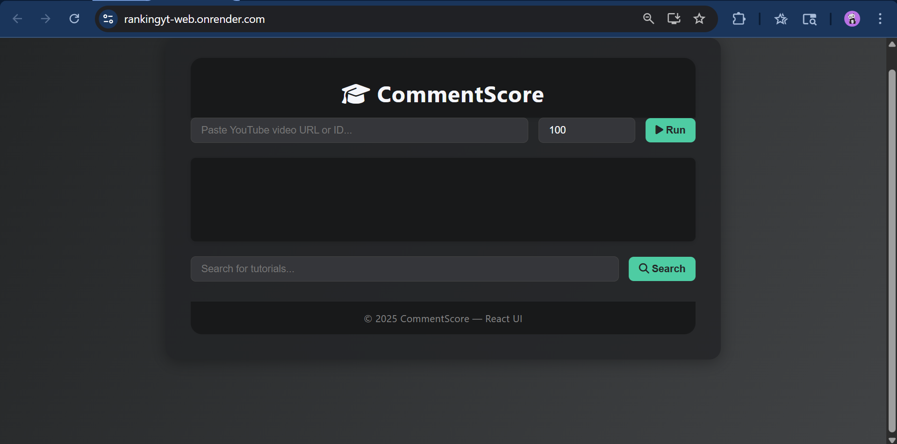
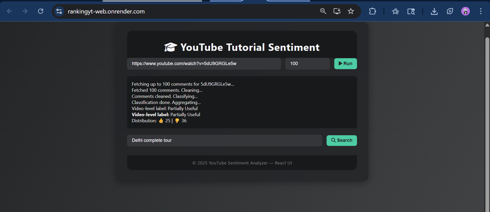

# CommentScore

### Using NLP and sentiment analysis to score YouTube tutorials by the quality of their audience reception

_A modular, end-to-end pipeline combining transformer models and classical ML to surface the best tutorials on any topic. By [Your Name]_

Finding a **good tutorial on YouTube** is harder than it should be. View counts and likes are gameable, thumbnails are misleading, and the algorithm optimizes for engagement — not educational quality. But **comments don't lie**. Viewers who genuinely learn something say so. Viewers who waste 20 minutes say that too.

This project treats **comment sentiment as a proxy for tutorial quality** and builds a full pipeline — from search to scored output — that lets you compare tutorials on any topic through the lens of how their audiences actually responded.

### Goal of the Project

The goal was to build a **reproducible, modular scoring system** that:
1. Searches YouTube for tutorials on a given keyword
2. Fetches and preprocesses comments at scale
3. Classifies sentiment using one of three ML approaches
4. Aggregates comment-level scores into a **per-video ranking**

Three independent modeling strategies were implemented and compared — from a classical TF-IDF pipeline to a custom fine-tuned transformer.

### What I Did

- I implemented **three distinct sentiment classification approaches**, each fully self-contained:

  - **Custom Fine-Tuned DistilBERT** (`Complex model/`): A DistilBERT model fine-tuned end-to-end on labeled YouTube comment data using TensorFlow and HuggingFace Transformers. Includes scripts for fine-tuning, model conversion, and inference. This is the **best performing model** — see results below.
  - **Pre-Trained DistilBERT** (`Dist-Bert model/`): Uses `distilbert-base-uncased-finetuned-sst-2-english` off the shelf — no training required. Fast and strong baseline for comparison.
  - **SGDClassifier** (`SDGClassifier model/`): A classical ML pipeline using TF-IDF vectorization and a Stochastic Gradient Descent classifier (scikit-learn). Supports **3-class classification** (Negative / Neutral / Positive). Model and vectorizer serialized with `joblib` for lightweight deployment.

- Each approach follows the **same modular pipeline** structured under `src/`:
  - `yt_search.py` — Search YouTube for videos by keyword
  - `data_fetch.py` — Download comments for a given video ID
  - `preprocess.py` — Clean and normalize comment text (tokenization, stopword removal, lemmatization)
  - `classify.py` — Predict sentiment labels using the approach-specific model
  - `aggregate.py` — Summarize comment-level predictions into a video-level score
  - `visualize.py` — Generate visualizations of per-video sentiment distributions
  - `evaluate.py` — Evaluate model performance with F-score and accuracy metrics

- A **Flask backend with SocketIO** powers real-time updates as comments are fetched and classified, exposed through a **React frontend** for live demo and visualization.

- **Jupyter notebooks** are included throughout for experimentation, model evaluation, and reproducibility.

### Architecture

```
┌─────────────────────┐    ┌─────────────────────┐    ┌─────────────────────┐
│    React Frontend   │    │   Flask Backend     │    │  Sentiment Models   │
│                     │    │                     │    │                     │
│ • Keyword Search    │◄──►│ • Route Engine      │◄──►│ • Fine-tuned BERT   │
│ • Scored Results    │    │ • SocketIO (RT)     │    │ • Pre-trained BERT  │
│ • Visualizations    │    │ • Video ID Parser   │    │ • TF-IDF + SGD      │
│ • Score Display     │    │ • Pipeline Trigger  │    │ • Score Aggregator  │
└─────────────────────┘    └─────────────────────┘    └─────────────────────┘
          │                          │                          │
          └──────────────────────────┼──────────────────────────┘
                                     │
                    ┌────────────────▼────────────────┐
                    │         Data Pipeline           │
                    │                                 │
                    │ • yt_search.py  (Search)        │
                    │ • data_fetch.py (Comments)      │
                    │ • preprocess.py (Clean & NLP)   │
                    │ • classify.py   (Inference)     │
                    │ • aggregate.py  (Score/Rank)    │
                    │ • visualize.py  (Charts)        │
                    └─────────────────────────────────┘
```

### Model Results

All three models were evaluated on held-out test data. Below are the results from the metric report.

#### 1. Pre-Trained DistilBERT (`distilbert-base-uncased-finetuned-sst-2-english`) — Binary

| Class | Precision | Recall | F1-Score |
|---|---|---|---|
| NEGATIVE | 0.75 | 0.83 | 0.79 |
| POSITIVE | 0.81 | 0.72 | 0.76 |

```
Confusion Matrix:
                 Predicted
                 NEG      POS
Actual  NEG    14,349    2,838
        POS     4,867   12,425
```

A solid out-of-the-box result for a model trained on movie reviews (SST-2), applied without any fine-tuning to YouTube comments.

---

#### 2. TF-IDF + SGDClassifier — Multiclass (Negative / Neutral / Positive)

| Class | Precision | Recall | F1-Score |
|---|---|---|---|
| NEGATIVE | 0.59 | 0.59 | 0.59 |
| NEUTRAL | 0.53 | 0.61 | 0.57 |
| POSITIVE | 0.70 | 0.60 | 0.65 |

```
Confusion Matrix:
                  Predicted
                  NEG      NEU      POS
Actual  NEG    10,076    5,219    1,892
        NEU     4,318   10,369    2,445
        POS     3,048    3,865   10,379
```

The only model to support **3-class classification** including a Neutral label. Performance is lower overall, which is expected given the harder task and lighter model — but inference is extremely fast with no GPU required.

---

#### 3. Fine-Tuned DistilBERT (`distilbert-finetuned-youtubetf`) — Binary ✦ Best Model

| Class | Precision | Recall | F1-Score |
|---|---|---|---|
| NEGATIVE | 0.86 | 0.91 | 0.88 |
| POSITIVE | 0.90 | 0.86 | 0.88 |

```
Confusion Matrix:
                 Predicted
                 NEG     POS
Actual  NEG    7,758     816
        POS    1,209   7,407
```

Fine-tuning DistilBERT directly on YouTube comment data yields a **substantial improvement** over the pre-trained SST-2 baseline — +9 F1 points across both classes. This is the recommended model for production use.

---

#### Summary

| Model | Task | F1 (Negative) | F1 (Positive) | Speed | GPU Required |
|---|---|---|---|---|---|
| Pre-trained DistilBERT (SST-2) | Binary | 0.79 | 0.76 | Medium | Recommended |
| TF-IDF + SGDClassifier | Multiclass | 0.59 | 0.65 | Fast | No |
| **Fine-tuned DistilBERT** | **Binary** | **0.88** | **0.88** | Medium | Recommended |

### Use

Each modeling approach is self-contained in its own folder with its own `requirements.txt`. To get started:

```bash
git clone https://github.com/your-username/CommentScore.git
cd CommentScore/
```

Choose your preferred approach and install its dependencies:

```bash
# Example: Fine-tuned DistilBERT approach (recommended)
cd "Complex model/"
pip install -r requirements.txt
```

Then launch the Flask backend:

```bash
python app.py
```

And in a separate terminal, start the React frontend:

```bash
cd yt-sentiment-ui/
npm install
npm start
```

> **Note:** Model weights and datasets are excluded from the repository due to size constraints. Scripts and notebooks for training are included — follow the fine-tuning notebooks to reproduce the weights for the custom DistilBERT approach.

### Examples

__


#### Ranking Video Output

__

#### Sentiment Distribution per Video

__

### References & Inspiration

- [**YouTube Comments Sentiment Analysis** — Ritika Singh et al.](https://ritikasingh95.github.io/Documents/Publications/YOUTUBE%20COMMENTS%20SENTIMENT%20ANALYSIS.pdf): Motivated the multi-algorithm comparison and the preprocessing pipeline (lemmatization, tokenization, stopword removal, n-grams). Guided evaluation using F-score and accuracy.

- [**Ranking of tutorials on YouTube based on the analysis of feelings made to their comments** — Goyzueta Torres et al., Innosoft Journal](https://revistas.ulasalle.edu.pe/innosoft/article/view/66/71): Directly inspired the core idea of using aggregated comment sentiment as a ranking signal, and the rationale for BERT-based approaches at scale.

### Thanks

- ... to the **HuggingFace team** for the Transformers library and the pre-trained SST-2 DistilBERT model.
- ... to **Ritika Singh et al.** and **Goyzueta Torres et al.** for the research that shaped this project's design.
- ... to the open-source community behind `scikit-learn`, `Flask`, and `SocketIO` for making rapid ML prototyping accessible.

---

_For questions or suggestions, feel free to open an issue or reach out._
